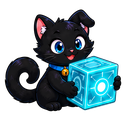

# OOWiki

> **开源边界 / Open-source scope**：本仓库及其文档源码 **OOWiki** 按仓库中的 [MIT License](LICENSE) 开源。OOCore、OOEngine、OOConsole、OOChat、OOGame、OOMusic、OOBrowser、OOReforge、OOVIP 等 OO 产品当前为闭源专有软件；其产品页、安装与配置文档、公开二进制发布信息和受控 SDK 说明不代表产品源码开源。

OO 系列产品的统一中文文档站，使用 MkDocs Material 构建。

站点标签、favicon 与顶部导航使用的 `docs/assets/logo.svg` 是 **OO 插件系列统一 Logo**，不只代表 OOWiki；各插件页面可复用该系列标识，但不得将它误写成某个单独插件的专属 Logo。

九个产品采用 **喵托邦 / Meowopia 黑猫品牌系列**；各自使用不同动作与道具。高清 PNG、网页 WebP 和小尺寸图标位于 [`docs/assets/branding/blackcat-v1/`](docs/assets/branding/blackcat-v1/)。品牌展示不代表规划功能已经上线。

- 在线地址：<https://meowopia.github.io/OOWiki/>
- 文档源码：[`docs/`](docs/)
- 架构状态：[架构与依赖](docs/architecture.md)
- 贡献方式：[CONTRIBUTING.md](CONTRIBUTING.md)
## 喵托邦 / Meowopia 品牌系列

| 基础（Core） | 附属（Extensions） | 独立（Standalone） |
| --- | --- | --- |
| <a href="docs/plugins/oocore.md"><br>OOCore</a> | <a href="docs/plugins/oogame.md"><br>OOGame</a> | <a href="docs/plugins/oovip.md"><br>OOVIP</a> |
| <a href="docs/plugins/ooengine.md"><br>OOEngine</a> | <a href="docs/plugins/oomusic.md"><br>OOMusic</a> | <a href="docs/plugins/ooreforge.md"><br>OOReforge</a> |
| <a href="docs/plugins/ooconsole.md"><br>OOConsole</a> | <a href="docs/plugins/oobrowser.md"><br>OOBrowser</a> |  |
|  | <a href="docs/plugins/oochat.md"><br>OOChat</a> |  |

## 仓库与许可证 / Repository and licensing

- 本仓库只承载 OOWiki 文档、主题和站点资源，不承载其他 OO 产品的内部源码、私有安全实现或私有 artifact 获取方式。
- 其他 OO 项目只链接经批准公开的产品页、安装/配置说明、二进制发布与受控 SDK 文档。
- 历史版本曾经公开时所适用的许可证及第三方许可证继续按其原始条款生效；当前政策不追溯撤回既有授权。
- 安全问题：[SECURITY.md](SECURITY.md)

## 文档状态

- `implemented`：已有实现与验证证据。
- `published`：artifact 或交付物已发布，坐标与摘要可核验。
- `code-prepared`：代码已准备，但运行时链路尚未验收。
- `planned`：设计已锁定，尚无可用实现。
- `blocked`：存在明确阻塞，不能宣称可用。

OOConsole `0.1.5` + OOCore `1.6.1` owner-bound 平台链已验收，可供消费者迁移。各消费者仍须完成自身产品验收；未完成前保持 disabled，不能批量标为 implemented。

## 产品分类

- **基础（Core）**：OOCore、OOEngine、OOConsole。
- **附属（Extensions）**：OOGame、OOMusic、OOBrowser、OOChat。
- **独立（Standalone）**：OOVIP、OOReforge。

分类仅用于产品与 Wiki 展示，不创建聚合 runtime、模块、Maven group、package、数据库或额外依赖。侧边导航平铺展示全部条目。

完整的组合原则、安全不变量、扩展点和降级规则见 [OO 生态愿景](docs/vision.md)。

## 本地验证

```powershell
python -m pip install --requirement requirements.lock.txt
python -m mkdocs build --clean --strict
python -m mkdocs serve
```

严格构建通过只证明文档可构建，不代表 `planned` 或 `blocked` 功能已经实现。发布 GitHub Pages 或 Release 前必须单独复核。

依赖更新先修改 `requirements.txt`，重新解析并审查 `requirements.lock.txt` 后再运行 strict build。Pages preview 与回滚步骤见[交付运行手册](docs/pages-runbook.md)。

## 配置 / Configuration

OOWiki 没有 Minecraft 插件 runtime 配置、语言配置或 secret。仓库唯一由维护者编辑的站点配置是 `mkdocs.yml`；修改导航、主题、插件或 Markdown extension 后需要重新执行 strict build，线上变化还需经批准重新发布 Pages。不要在配置、文档或 workflow 中写入 token、密码或私钥。

OOWiki has no Minecraft plugin runtime, language, or secret configuration. Its only maintainer-edited site configuration is `mkdocs.yml`. Re-run the strict build after changing navigation, theme, plugins, or Markdown extensions; production changes also require an approved Pages deployment. Never store tokens, passwords, or private keys in configuration, docs, or workflows.

## 联系 / Contact

- 作者 / Author: zkonikishi
- QQ: 276098266
- Discord: <https://discord.gg/KPq2fZHFK>
- [ifdian](https://ifdian.net/a/zkonikishi)
- QQ群 / QQ Group: 1063369777
