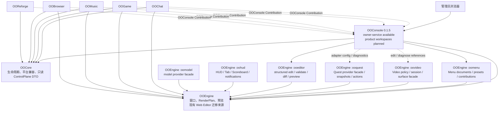
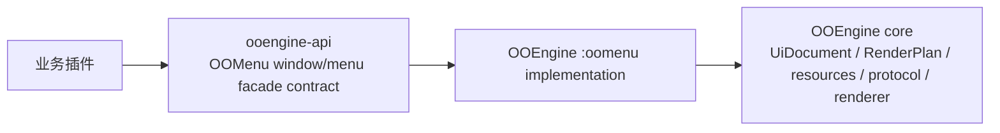
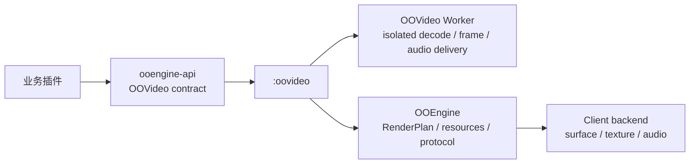

# 架构与依赖关系

## 总体架构

!!! warning "实现状态"
    OOCore `1.6.1` 与 OOConsole `0.1.5` owner-bound 平台链已验收，可供消费者迁移。各消费者仍需完成自身产品验收；HTTP/UI、Editor 迁移和产品工作区仍为 **planned/code-prepared**。Window blocker 独立保留。

## 边界与所有权

| 组件 | 拥有 | 不拥有 |
|---|---|---|
| OOCore | 生命周期、Paper/Folia 兼容、Capability、服务注册；通过 `oocore.control-plane.read.v1` 提供只读 ControlPlane DTO | 管理页面、编辑器、业务写操作 |
| OOEngine | 玩家窗口、RenderPlan、预览、现有 Web Editor 源实现 | OOConsole Contribution API、业务插件管理后台 |
| OOEngine `:oomenu` | 通用 Menu document/presets、MenuContribution registry/validation、应用目录合成、Menu 玩家偏好与 fixtures | 独立插件/Mod/仓库、第二套 renderer/schema/resource lifecycle |
| OOConsole（目标；runtime blocked） | planned 的统一管理入口、RBAC、审计、工作区和可视化编辑器；SDK compile surface 已发布；目标运行时硬依赖 OOCore 与 OOEngine | Minecraft 版本适配、第二套窗口 schema/RenderPlan/资源/预览/Editor engine、业务插件内部状态 |
| 业务插件 | 自己的数据、命令、校验与 owner-scoped Contribution | 自建后台、跨 owner 修改、读取其他插件私有目录 |

OOCore `1.6.1` 的 `oocore.control-plane.read.v1` 只返回 bounded、不可变、可序列化的只读 DTO。OOConsole 的写操作必须调用拥有该资源的插件所暴露的受权 command/action，不得把 OOCore 变成万能写入通道。

## OOMenu 归属（planned）

`ooengine-api:1.1.4` 与 `ooengine-testkit:1.1.4` 已 published/verified，SHA-256 分别为 `43E0C7EBA6996BCEB7FEF09D9C9737888CD2771B12A1B00792CA0B5C69BD4328`、`6C76758AC66C5024FB33FCAD234A606354399B1394BE0E1332A7464555F6FE0C`。这只验收 Window/Menu/Video API surface；OOMenu bootstrap/cleanup、OOVideo migration 与 server runtime wiring 仍 pending。

`1.1.4` Window registration surface 缺 `WindowController`，Contribution 仍重复 `ownerId`，scope-derived owner validation 未完成。因此 facade 不完整且 migration runtime-blocked；禁止与 legacy `PanelController` 混用。Menu/Video 尚待同等级完整性审计。

OOMenu 是 OOEngine 仓库内的 Gradle module `:oomenu`，Java package 为 `com.zkonikishi.ooengine.menu`，随 OOEngine server artifact 集成发布。它不是独立 Paper 插件、Mod、仓库或产品依赖，也不注册 `/oo menu`；玩家入口始终是 `/oo engine menu`。

`:oomenu` 拥有 default/MMO/mobile/phone/Android-tablet presets、MenuContribution registry/validation、应用目录合成、主题/壁纸/排序/方向偏好模型与 menu fixtures。OOEngine core 继续拥有 `UiDocument`、RenderPlan、resources、session 和 action；`:oomenu` 只能消费稳定内部接口，禁止复制这些实现。

首发目标为 `ooengine-api` / `ooengine-testkit` `1.1.4`，保持 `OOEngineApi.API_VERSION = 1` additive。窗口 Capability 为 `ooengine.window-contribution.v1`，入口 `ExtensionScope.window(WindowContribution)`；目标 controller 为 `WindowController`，但 `1.1.4` API JAR 尚未包含该类型；Menu app entry Capability 为 `ooengine.menu-contribution.v1`，入口 `ExtensionScope.menu(MenuContribution)`。实现位于 `:oomenu`，API/testkit artifact 已 published；server runtime wiring 与 lifecycle 验收仍 pending。

所有业务插件的窗口接入也统一经 OOMenu facade：

OOMenu 负责 owner-scoped window contribution、Menu app entry、窗口发现与 open/patch/close 安全编排、namespace/limits/revision/requestId 校验和 lifecycle 撤销。业务插件不得直接依赖 OOEngine server/common implementation、`PanelRepository`、session manager、renderer 或 data folder；OOConsole 的 Window/Menu workspace 同样只能调用 OOMenu facade。

公开 Java contract 继续由 `ooengine-api` 发布，消费者不编译依赖内部 `:oomenu` implementation。`PanelContributionRegistry`、`PanelController`、`ExtensionScope.panel(...)` 自 `1.1.4` 标记 `Deprecated(forRemoval=false)`，整个 API 1.x 由 runtime 委托 OOMenu；最早 API 2.0 才允许删除，目前不设删除日期。新插件只能使用正式发布后的 Window/Menu facade，不得新接 legacy panel API。

## OOVideo 归属（planned）

OOVideo 是 OOEngine 仓库内的 Gradle module `:oovideo`，Java package `com.zkonikishi.ooengine.video`，不是独立插件、Mod 或仓库，不注册 `/oo video`。正式 Capability 为 `ooengine.video.v1`；公开稳定 contract 从 `ooengine-api` 暴露，实现位于 `:oovideo`，并随 OOEngine/Client 对应产物发布。

OOVideo 负责 signed descriptor/manifest、source policy、play/pause/seek/stop、timeline sync、surface/window binding、capability negotiation、poster fallback、owner/session lifecycle、worker launch、platform/FFmpeg decode、frame/audio delivery、client sink、FCL backend、资源释放和尺寸/码率/时长/并发预算。业务插件不得直接调用 worker、FFmpeg、texture/audio sink、浏览器或 OOEngine internal video implementation。

公开类型首版锁定为 `OOVideo`、`OOVideoScope`、`VideoContribution`/`VideoDescriptor`、`VideoController`、`VideoSession`、`VideoState`/`VideoResult`。入口由 owner-fixed `ExtensionScope` 返回 `OOVideoScope`（例如 `openScope(owner).video()`）；DTO 禁止自报 owner。插件注册 owner namespaced `videoId` 与受策略资源引用，再由 controller 对 UUID/window surface 执行 open/play/pause/seek/stop/close。所有 mutation 携带 requestId/revision，并返回 immutable、bounded result；禁止任意 URL、path、command 或 script。

OOBrowser 只负责 Chromium/Web surface。网页视频进入 OOEngine video surface 时仍必须经过 OOVideo policy，不能形成第二套通用视频协议。旧 `:media`、`oomedia-worker`、`com.zkonikishi.ooengine.media.*` 和 `Media*` 自 `1.1.4` 标记 deprecated shim 并委托 OOVideo，整个 API 1.x 保持兼容，最早 API 2.0 才允许删除。迁移必须覆盖 artifact/config/cache/pin，保持服务器 UID 隔离，原子执行并可回滚；Fabric/NeoForge/FCL、MP4/WebM、签名、资源释放与长跑门禁通过后才能删除。禁止复制第二套 decoder/session/cache。

## OOQuest 任务 facade（planned）

OOQuest 是 OOEngine 仓库内的 Gradle module `:ooquest`，Java package `com.zkonikishi.ooengine.quest`，不是独立 Paper 插件、任务引擎或仓库。公开 stable contract 从 `ooengine-api` 发布，实现归 `:ooquest`。首版目标 Capability 为 `ooengine.quest.v1`。

!!! info "双重归属"
    OOQuest 只是 OOEngine 内部的任务接入接口，工程、生命周期和文档归属均为 `OOEngine > :ooquest`。它不是独立插件，也不建立额外产品分类、artifact、group、package 或仓库。

OOQuest 统一适配 BetonQuest、Typewriter、Quests、BeautyQuests、MMO/Mythic 任务源及未来 Provider，供 OOMenu、未来 OOHUD 和 OOConsole 消费。第三方 Provider 始终是任务状态、前置条件、推进与奖励的权威源；OOQuest 不复制数据库或状态机，也不存储或裁定业务真相。

公开 API 目标包括 owner-fixed `ExtensionScope.quest(QuestContribution/QuestProvider)` 或 `OOQuestScope`、`QuestService`/`QuestController`，以及 immutable、bounded 的 `QuestSnapshot`、`QuestJournal`、`QuestEntry`、`QuestObjective`、`QuestProgress`、`QuestActionRequest`、`QuestActionResult`、`QuestEvent`。任务 ID 必须使用 provider-owner namespace；snapshot 携带 provider revision。

accept/track/untrack/submit/abandon mutation 必须携带 requestId、expectedRevision 和 actor UUID。Provider 必须二次校验权限和前置条件，并返回新 revision 与明确 result code。客户端只能发送 intent，不能自报完成度、奖励或任务状态；禁止任意 command/script/path/SQL，奖励和任务推进只能由权威 Provider 事务处理。

注册与订阅采用 owner scope，provider disable/reload、player quit、server switch 时幂等释放。接口必须定义 sync/async/entity execution policy、timeout/cancel、bounded subscription 与 backpressure；事件乱序按 revision 拒绝，不得强持有 `Player` 或 `Plugin`。

任务列表、详情和追踪窗口通过 OOMenu Window facade；HUD tracker 归未来 OOHUD；OOConsole 只配置 adapter/显示映射并展示脱敏诊断；Typewriter 对话内容仍归对话/OOChat 边界，不进入 Quest 状态接口。

旧 `com.zkonikishi.ooengine.api.quest.*` 从 common 迁入 `ooengine-api` compatibility surface，自 `1.1.4` 标记 deprecated shim 并委托 OOQuest。整个 API 1.x 保持兼容，最早 API 2.0 才允许删除。新插件只使用 OOQuest；artifact 发布前只等待，不自造 bridge。

## OOEditor、OOHUD 与 OOModel（planned）

- **OOEditor**：OOEngine 子项目 `:ooeditor`，package `com.zkonikishi.ooengine.editor`。负责 `UiDocument` 结构化编辑、validation、operation、revision diff、preview compile、screenshot request 与 publish candidate；不是独立插件。OOConsole 只能复用 OOEditor，禁止复制 editor engine。
- **OOHUD**：OOEngine 子项目 `:oohud`，package `com.zkonikishi.ooengine.hud`。统一 HUD、Tab、Scoreboard、BossBar、Toast、Subtitle 与 notification overlay。planned Capability 只使用 `ooengine.hud-contribution.v1`，不再新增任何旧 overlay 命名的 Capability。
- **OOModel**：模型 Provider facade。BetterModel adapter 为 **planned optional adapter**，只通过官方 `io.github.toxicity188:bettermodel-bukkit-api` compileOnly API 接入；不得复制、内嵌或反射 BetterModel，也不得形成强依赖。Provider 缺失或版本不兼容时只禁用该 adapter。

BetterModel adapter 必须具备独立 Capability/fixture、tracker owner lifecycle，以及 entity/player quit、chunk unload、plugin disable 的幂等清理；同时明确 Folia execution policy 和 resource-pack 冲突策略。没有真实代码、测试与 artifact 前不得标记 implemented。

## OOConsole 工作区模型（planned）

Editor 是 OOConsole 内的一个工作区，不是独立产品。建议工作区包括：

- `overview`：运行状态和只读健康摘要；
- `editor`：从 OOEngine Web Editor 分阶段迁移的 Window/Menu 编辑能力，包括 Android 平板在内的 `menu` 响应式 presets；不创建 Tablet workspace 或独立导航页；
- `plugins/<owner>`：由业务插件贡献的管理视图；
- `audit`：高风险操作与登录审计；
- `settings`：仅 OOConsole 自身配置。

业务插件通过 **owner-scoped OOConsole Contribution** 注册 workspace、view、form、table 和受权 named action。首版 Capability 固定为 `ooconsole.editor-contribution.v1`。Contribution API 属于 OOConsole stable API，不属于 OOEngine；业务插件对 OOConsole 仅为 optional dependency，缺失时只降级对应可视化工作区。

## RBAC 与安全基线（planned）

- 默认拒绝；角色只授予工作区、资源和 action 的最小权限；
- owner scope 强制绑定，`oochat` 不能声明或修改 `oogame:*`；
- 高风险 action 需要重新认证、CSRF、防重放 request ID 和审计记录；
- 登录限流、短期 session、HttpOnly/SameSite Cookie、严格 Host/Origin allowlist；
- 默认只监听回环地址；远程访问必须经 HTTPS reverse proxy；
- DTO、请求体、列表页、上传和导出均设置大小/数量/时间预算；
- 不向浏览器发送数据库凭据、Provider secret、原始 token、任意文件路径或任意控制台命令；
- Contribution 只描述受控 UI 和 action，不执行插件提供的任意 HTML/JavaScript。

## 不得自建后台

OOChat、OOGame、OOMusic、OOBrowser、OOReforge 以及后续 OO 系列插件不得启动自己的管理 HTTP 服务或复制登录、RBAC、审计、Editor。需要后台能力时必须贡献到 OOConsole；OOConsole 不可用时，插件核心业务应继续运行，并仅降级管理界面。

## 迁移顺序

1. **implemented**：保留并维护 OOEngine Web Editor，继续修复安全问题。
2. **implemented / available for migration**：OOConsole `0.1.5` + OOCore `1.6.1` owner-bound 平台链已验收。消费者 adapter 只有完成自身产品验收后才能升级为 implemented。
3. **implemented / per-plugin**：OOCore 已发布只读 ControlPlane DTO Capability；OOGame、OOMusic、OOBrowser adapter 已验收，其他插件逐项状态见产品页，未验收者仍待接入。
4. **planned**：将 Web Editor 迁入 OOConsole 的 `editor` 工作区，做数据与行为兼容验收。
5. **planned**：只有迁移、回滚、权限和安全验收通过后，才允许废弃 OOEngine 内置入口；删除源实现必须另行决策。
