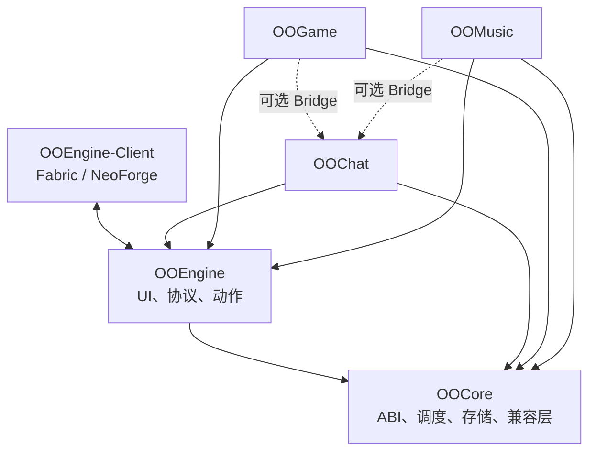

# 架构与依赖关系

## OOCore 边界

OOCore 提供稳定模块 ABI、capability session、Paper/Folia scheduler abstraction、模块隔离存储和平台 facade。scheduler、Component/text、registry/key、player/entity/item/data component 与 plugin channel 均应通过 OOCore。

当前 ABI 规则：`ABI_VERSION = 1` 在 1.x 内保持二进制兼容；新增 API 可不提升 ABI，破坏性改动必须发布新 ABI。

## OOEngine 边界

服务端将 YAML 编译成不可变 `UiDocument`。事件包含 panel id、document revision、widget id、action 和防重放 request id。客户端拒绝 panel 或 revision 不匹配的 patch。

OOEngine 负责渲染与事件投递；业务模块负责业务状态和授权。模块不得直接读写 OOEngine 数据目录。

## 客户端安全模型

- 客户端消息只是 intent。
- Web panel 使用短期认证 session，bridge 不暴露任意命令执行。
- Web URL 必须匹配 exact scheme/host/port origin allowlist。
- VIDEO manifest 由服务端 Ed25519 签名；客户端 pin endpoint，校验 origin、大小与 SHA-256 后才交给隔离 worker。

## 降级策略

- OOCore 或 OOEngine 等硬依赖缺失：模块禁用。
- 必需 capability 缺失：注册命令、channel、provider 或 action 前 fail-fast。
- OOChat、地图、任务或小游戏 Provider 等可选集成缺失：只降级相关功能。
