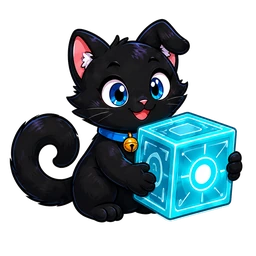
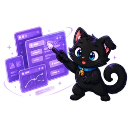

---
hide:
  - navigation
  - toc
  - footer
---

<section class="wiki-hero">

<h1>让想法，在 <em>OO</em> 中实现。</h1>
Meowopia 为 Minecraft 服务器提供可组合的插件、框架与创作工具。

<a class="wiki-primary" href="installation/">开始使用</a><a class="wiki-secondary" href="plugins/">浏览插件</a>

</section>
<button class="wiki-search-launch" type="button" data-open-doc-search><strong>需要帮助？搜索文档</strong><small>查找安装、配置、命令与 API 等内容</small><kbd>Ctrl K</kbd></button>
<section class="wiki-directory"><h2>找到适合你的插件</h2>
<button type="button" data-plugin-filter="all" class="is-active">全部</button><button type="button" data-plugin-filter="core" class="">基础（Core）</button><button type="button" data-plugin-filter="extensions" class="">附属（Extensions）</button><button type="button" data-plugin-filter="independent" class="">独立（Standalone）</button>

  <a class="plugin-card" href="plugins/oocore/" data-category="core" data-search="oocore 核心 core 生命周期 命令 capability">
    
Stable 1.7.3

    
基础（Core）<h2>OOCore</h2>
OO 生态的平台前置，统一生命周期、命令、Capability 与可信 owner-service。

    
平台核心<b>查看文档 →</b>

  </a>
  <a class="plugin-card" href="plugins/ooengine/" data-category="core" data-search="ooengine 核心 core window ui renderplan menu video editor hud">
    
Stable 1.1.6

    
基础（Core）<h2>OOEngine</h2>
提供 owner-bound Window、RenderPlan、资源、协议与客户端渲染能力。

    
表现引擎<b>查看文档 →</b>

  </a>
  <a class="plugin-card" href="plugins/ooconsole/" data-category="core" data-search="ooconsole 核心 core console editor workspace owner service admin">
    
Stable 0.1.6

    
基础（Core）<h2>OOConsole</h2>
统一管理与可视化编辑入口；owner-service 已验收，产品工作区仍逐项建设。

    
管理平台<b>查看文档 →</b>

  </a>
  <a class="plugin-card" href="plugins/oogame/" data-category="extensions" data-search="oogame extensions game lobby 斗地主 房间 匹配">
    
Paused · Unreleased

    
附属（Extensions）<h2>OOGame</h2>
小游戏大厅、Provider 聚合、房间、活动与完整回合状态机。

    
游戏大厅<b>查看文档 →</b>

  </a>
  <a class="plugin-card" href="plugins/oomusic/" data-category="extensions" data-search="oomusic extensions music lyrics timeline 歌词 音乐 播放">
    
Paused · Unreleased

    
附属（Extensions）<h2>OOMusic</h2>
曲库、队列、同步听与 bounded LyricsDocument / LyricsTimeline 服务。

    
音乐服务<b>查看文档 →</b>

  </a>
  <a class="plugin-card" href="plugins/oobrowser/" data-category="extensions" data-search="oobrowser extensions browser chromium mcef dns pin web">
    
Paused · Unreleased

    
附属（Extensions）<h2>OOBrowser</h2>
受策略控制的 Web surface 与 DNS pin transport；浏览器运行时仍处于未发布阶段。

    
浏览器表面<b>查看文档 →</b>

  </a>
  <a class="plugin-card" href="plugins/oochat/" data-category="extensions" data-search="oochat extensions chat social friend mail 聊天 好友 邮件">
    
Stable 0.1.0

    
附属（Extensions）<h2>OOChat</h2>
0.1.0 提供基础命令入口；完整聊天、好友与邮件功能尚未正式发布，不包含 Window/UI。

    
社交系统<b>查看文档 →</b>

  </a>

  <a class="plugin-card" href="plugins/oovip/" data-category="independent" data-search="oovip independent vip membership 会员 权益">
    
Paused · Unreleased

    
独立（Standalone）<h2>OOVIP</h2>
会员生命周期与权益编排插件，当前暂停且未发布。

    
会员权益<b>查看文档 →</b>

  </a>
  <a class="plugin-card" href="plugins/ooreforge/" data-category="independent" data-search="ooreforge independent reforge equipment 装备 锻造">
    
Paused · Unreleased

    
独立（Standalone）<h2>OOReforge</h2>
装备、锻造、品质与配方插件，当前暂停且未发布。

    
装备锻造<b>查看文档 →</b>

  </a>

没有找到匹配的插件。

</section>
<section class="wiki-help"><h2>从安装到配置，都有迹可循。</h2><a href="installation/">安装与升级</a><a href="configuration/">配置参考</a><a href="troubleshooting/">故障排查</a><a href="development/">开发接入</a></section>

