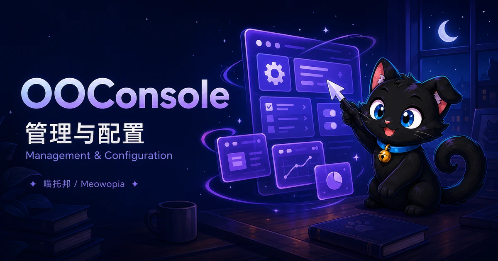

# OOConsole



**分类：基础（Core）。**

OOConsole 是喵托邦（Meowopia）OO 系列的管理与可视化编辑插件，属于基础（Core）。当前正式版 **0.1.6** 提供管理基础能力：状态命令、插件贡献接口，以及可选的本机 HTTP 登录、会话与只读接口。**它还不是完整的网页管理面板。**

!!! info "当前可用范围"
    `/oo console` 只显示状态；HTTP Dashboard 目前仅返回只读 JSON。可视化窗口编辑、预览发布以及完整插件、资源管理工作区仍在规划中，不应当作已可用功能。

!!! warning "历史版本"
    0.1.4 的 runtime 制品存在版本标识错误，不要安装。安装服务端插件请使用正式版主 JAR，不要用开发者 SDK 或 testkit 代替。


## 固定标识

| 项目 | 值 |
|---|---|
| 产品名 | `OOConsole` |
| Java package | `com.zkonikishi.oo.console` |
| plugin/module ID | `ooconsole` |
| 规范命令 | `/oo console` |
| 运行时硬依赖 | `OOCore`、`OOEngine` |
| plugin descriptor | `depend: [OOCore, OOEngine]` |
| API version | `API_VERSION = 1`（implemented） |
| Capability | `ooconsole.editor-contribution.v1`（compile contract published；owner-bound acquisition available；具体贡献逐项验收） |

## 已实现功能 / Implemented

以下均指正式版 **0.1.6**，运行时需要 OOCore 与 OOEngine：

- **状态查询**：有权限的玩家或控制台可用 `/oo console` 查看版本和 HTTP 状态。
- **本机只读接口**：显式启用后支持健康检查、固定管理员登录、会话/CSRF、最小 Dashboard JSON 和登出；已验证本机客户端流程，不是完整浏览器界面。
- **插件接入基础**：提供可信身份绑定的贡献接口，以及操作校验、权限与审计基础。需要对应插件完成适配；不自动生成完整管理页面。
- **启停清理**：正式版已通过服务器启动、命令、HTTP 及正常停止清理验收。

## 未实现功能 / Not implemented

- **尚未提供**：浏览器登录页、完整首页与导航；当前不能把接口地址当作可操作的网页面板。
- **仅底层已具备**：窗口编辑、预览、保存发布所需的部分接口基础；服主目前不能通过 OOConsole 完成这条可视化流程。
- **尚未提供**：完整插件管理、资源管理及安全审计工作区；没有网页多用户/角色管理。
- **尚未开放**：用户配置文件、配置编辑页和热重载命令。
- **未完成迁移**：不能用本版替代并删除旧 OOEngine Web Editor。

## 未来计划 / Roadmap

- 沿用 OOEngine 的正式编辑与窗口能力，完善结构化编辑、校验、预览、版本检查及保存发布流程，不另造编辑引擎。
- 通过已适配插件的受控贡献逐步提供管理工作区；保持权限复验和审计，不扩展成任意命令或脚本执行器。
- 配置开放时配套版本、校验、中英说明及升级回滚；旧编辑器先共存验收，再考虑迁移。

这些是已规划方向，不是已发布功能，也不承诺上线日期或指定版本。

## 安装

1. 先准备能够正常运行的 Paper 服务端，以及 **OOCore、OOEngine** 两个前置插件。缺少任意一个，OOConsole 都无法启动。
2. 从获授权的正式分发渠道取得 `OOConsole-0.1.6.jar`。关闭服务器后，将主 JAR 放入服务器的 `plugins/` 目录；不要同时保留不同版本的 OOConsole JAR。
3. 启动服务器，在控制台执行 `oo console` 查看版本和状态。默认显示 `HTTP=disabled` 是正常行为，不表示启动失败。

0.1.6 已验证的前置组合为 OOCore **1.7.1** 与 OOEngine **1.1.6**，不是要求未来只能使用这两个精确版本。其他版本还必须提供兼容的插件接口、命令入口和可信身份服务；仅凭版本号更大不能保证兼容。不要使用已撤回的 OOCore 1.7.0。

已记录的服务端环境为 Minecraft 26.2、Paper 26.2 build 92、Microsoft Java 25.0.4.7、Windows。其他环境的验证情况见下方已知问题。

## 配置 / Configuration

**当前没有用户可编辑的 OOConsole `config.yml`、语言文件或网页配置页。** 手工新建这些文件不会生效。可选 HTTP 接口通过服务器 Java 进程的启动设置启用，修改后需要完整重启服务器；没有 `/oo console reload`。

| 设置 | 类型与默认值 | 作用与示例 |
|---|---|---|
| `ooconsole.http.enabled` | JVM 布尔属性，默认 `false` | `-Dooconsole.http.enabled=true` 启用本机 HTTP 接口；应放在 Java 启动命令的 `-jar` 之前 |
| `ooconsole.http.port` | JVM 整数属性，默认 `0` | `0` 自动分配端口；也可选择空闲端口，例如 `-Dooconsole.http.port=8765`。端口范围 0–65535，实际可用性取决于系统权限和占用情况 |
| `OOCONSOLE_HTTP_PASSWORD` | 启动进程的环境变量，无默认密码 | 启用 HTTP 时必须提供至少 12 个字符的密码；通过宿主服务的保密环境设置注入，不放在命令行、公开脚本或日志中 |

HTTP 启用却缺少有效密码、端口不可用或前置不满足时，启动会失败并回滚，不会自动退回无认证模式。关闭 HTTP 时不需要提供密码。

HTTP 固定绑定 `127.0.0.1`，没有开放监听公网地址的配置。启动日志会显示 `OOConsole HTTP ready` 和实际地址；也可以用 `/oo console` 查看实际端口。默认动态端口可能随重启变化。

OOConsole 0.1.6 has no user-editable configuration file. The optional HTTP interface is disabled by default, binds only to IPv4 loopback, and uses JVM startup properties plus a password environment variable. Restart the server after changing these settings; no reload command is provided.

### 本机 HTTP 与登录

当前没有登录网页，也没有浏览器首页；以下是给本机管理客户端使用的接口。请求地址使用服务器本机的 `http://127.0.0.1:实际端口`，不要把自己的电脑地址误认为远程服务器地址。

| 请求 | 凭据与用途 | 正常结果 |
|---|---|---|
| `GET /health` | 不需登录，检查接口是否运行 | `200`，`{"status":"ok"}` |
| `POST /session` | HTTP Basic 认证；用户名固定为 `admin`，密码为上述环境变量提供的值 | `200`，返回 `OOSESSION` Cookie 和 JSON 中的 `csrf` |
| `GET /dashboard` | 同时携带登录 Cookie 和 `X-OO-CSRF` 请求头 | `200`，`{"workspace":"Dashboard","mode":"read-only"}` |
| `DELETE /session` | 同时携带登录 Cookie 和 `X-OO-CSRF` 请求头，撤销当前会话 | `204`；旧会话不能继续访问 |

会话有效期为 30 分钟，重启后需要重新登录。登录凭据无效返回 `401`；Dashboard 或登出缺少有效会话/CSRF 返回 `403`。接口有限流，频繁请求可能返回 `429`，应停止重试并稍后访问。

Cookie 带有 `Secure`、`HttpOnly` 和 `SameSite=Strict` 属性。由于此版接口使用本机 HTTP，不应假定所有浏览器或客户端都会自动回传 Cookie；当前验证范围是本机管理客户端，并非通用浏览器登录体验。不要为此关闭认证校验或转发到公网。HTTP Basic 的编码不是加密，凭据只应交给受控的本机客户端。

### Java 21 兼容计划

Java 21 支持是新增兼容目标，**不是当前 0.1.6 已支持的能力**。0.1.6 仍按原有 Java 25 服务端环境使用。

计划先验证 Paper 1.20.5、1.20.6 及 1.21–1.21.11 的相关版本，再评估更早的 1.20.x。需要 OOCore、OOEngine 同时提供兼容版本，并完成真实服务器启动、登录和关闭测试；目前尚未验收，不承诺发布日期。

现有 Java 25 / 26.x 支持继续保留。Minecraft 26.x 服务端需要 Java 25，不能改用 Java 21。此计划不等于新增 Spigot 或 Folia 支持。

MC/Paper/Folia 的跨版本识别与适配统一由 OOCore 负责，OOConsole 不另建兼容层；OOConsole 仍需保证自身及依赖能够在 Java 21 加载，并通过实际功能验证。仅升级 OOCore 不能使当前要求 Java 25 的 OOConsole 制品直接运行在 Java 21 上。

## 联系 / Contact

- 作者 / Author: zkonikishi
- QQ: 276098266
- Discord: <https://discord.gg/KPq2fZHFK>
- [ifdian](https://ifdian.net/a/zkonikishi)
- QQ群 / QQ Group: 1063369777

## 命令与入口

以下为 OOConsole **0.1.6 正式版**已提供的命令。`/oo` 根入口由 OOCore 提供，OOConsole 不单独注册根命令。

| 完整语法 | 参数与默认值 | 用途 | 精确权限 | 执行位置 | 最小示例 |
|---|---|---|---|---|---|
| `/oo console` | 无必填或可配置参数 | 显示版本、HTTP 启用状态及贡献接口状态；不会打开可视化编辑器 | `ooconsole.admin` | 玩家及服务器控制台；仍须通过权限检查 | 玩家输入 `/oo console`；服务器控制台输入 `oo console` |

默认未启用 HTTP 时，输出示例：

```text
OOConsole 0.1.6: HTTP=disabled; runtime contribution API active
```

启用 HTTP 后，`disabled` 会显示为 `loopback:端口号`。当前处理器不解析后续参数；添加 `editor`、`reload` 等文字不会执行编辑或重载操作，也不构成已支持的子命令。当前没有命令别名。

## 权限

| 精确节点 | 对应功能 | 默认授权 | 继承关系 |
|---|---|---|---|
| `ooconsole.admin` | 允许执行 `/oo console` 状态查询 | `default: op`：OP 默认有，普通玩家默认没有；控制台按服务端权限系统判断 | OOConsole 未声明父子权限或通配符 |

需要让非 OP 使用该命令时，通过服务器权限管理插件显式授予 `ooconsole.admin`。不要把未声明的 `ooconsole.*` 当作本插件提供的通配权限。此节点不等于网页登录凭据，也不会自动授予网页管理员身份。

## 变量与占位符

**当前版本暂无对外变量/占位符。**

| 类型 | 0.1.6 支持情况 |
|---|---|
| PlaceholderAPI / PAPI | 未提供 OOConsole expansion，无可填写的 `%ooconsole_…%` 变量 |
| 消息模板变量 | 未开放用户自定义消息模板及替换变量 |
| UI 绑定变量 | 未开放可由服主填写的 OOConsole UI 绑定接口 |
| 配置替换变量 | 未提供用户配置文件的变量替换机制 |

命令输出中的版本和 HTTP 端口、HTTP 返回数据里的字段，都不是可在其他插件配置中使用的占位符。部署环境变量 `OOCONSOLE_HTTP_PASSWORD` 是启动凭据来源，不是 PAPI 或消息变量；不要把密码写进公开页面、聊天或日志。

## Contribution 规范（planned）

此标题中的 planned 指具体可视化工作区，不代表插件接入接口完全未实现。0.1.6 已提供身份绑定的 V1/V2 插件贡献接口；每个接入插件仍需单独完成适配，不能因为安装 OOConsole 就自动出现所有插件的管理页面。

贡献的操作必须经过权限、参数、版本和生命周期检查，由相应插件负责最终业务校验。完整可视化编辑、预览和发布流程仍未开放给服主使用；不提供任意脚本、SQL、服务器命令或文件浏览执行器。

## RBAC（planned）

此标题保留的是角色管理界面的规划。运行时已有角色和权限校验基础，但 0.1.6 的 HTTP 启动接线只提供固定的 `admin` 登录身份，没有多用户、角色编辑或网页权限管理页。游戏内 `ooconsole.admin` 权限与 HTTP 登录不是同一套凭据。

## 安全与部署（planned）

0.1.6 已实现本机 HTTP 接口的 Host/Origin 检查、会话撤销与过期、CSRF、Cookie 属性及请求限制；公网部署、反向代理和完整网页管理体验不在当前已验证范围内。

当前凭据来自启动环境，不是用户密码数据库，也没有自动显示 bootstrap token 的功能。请限制谁能读取服务器进程环境和操作本机管理客户端。不要将 HTTP 端口对外转发。

## 迁移约束

升级前完整停止服务器并备份插件及相关数据，替换主 JAR 后重启检查 `/oo console`。需要回滚时停止服务器，恢复先前已验证的 JAR 和对应备份；不要混放多个版本，也不要回滚到有缺陷的 0.1.4 runtime。HTTP 启动设置需同步检查，会话不会跨重启保留。

OOConsole 尚未完成旧 OOEngine Web Editor 的功能等价迁移。旧编辑器继续保留，安装本版不能作为删除旧编辑器或迁移其数据的依据。

## 已知问题

- 没有完整网页首页、登录页或可视化编辑工作区；Dashboard 只是最小只读 JSON，不包含完整监控指标。
- HTTP 没有编辑、保存或发布接口；底层贡献接口存在，不等于这些网页功能已经开放。
- 暂无用户配置文件、多用户管理、密码修改页面或热重载命令。
- 仅支持本机 HTTP 接入；通用浏览器 Cookie 行为及公网反向代理未验收。
- Windows 原生库加载已验证；Linux Argon2/JNA 原生加载、Folia 运行仍未纳入此版本已验收范围。
- 完整编辑工作区没有已承诺的交付日期；规划内容不代表当前可安装功能。
