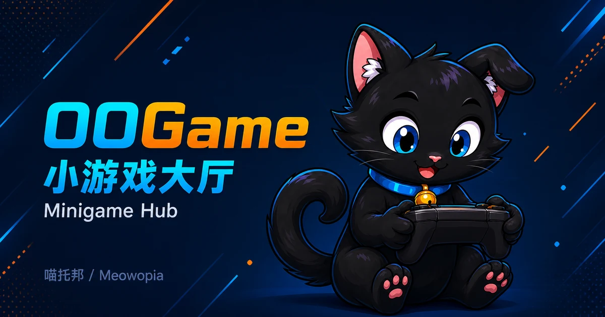

# OOGame

OOGame 是 Meowopia（喵托邦）的小游戏大厅与游戏 Provider 聚合项目，归入**附属（Extensions）**。目标是让玩家从统一大厅发现游戏、排队和进入房间，具体玩法由服务端游戏 Provider 裁决。

> **开发版参考，尚无正式 Release。** 本页于 2026-09-02 核验，当前项目版本为 `0.1.0-SNAPSHOT`，功能开发处于冻结状态。已有源码和测试不代表完整大厅已可安装使用；本页不提供稳定版下载或生产部署承诺。

## 命令

`/oo` 根入口属于 OOCore，OOGame 不注册独立根命令。以下仅描述开发版事实，不是正式版本命令保证。

| 语法 | 参数与默认值 | 用途及当前状态 | 精确权限 | 执行者 | 最小示例 |
| --- | --- | --- | --- | --- | --- |
| `/oo game` | 无已实现参数；没有分页、重载或管理子命令 | 产品约定的大厅入口；当前模块注册与路由存在不一致，尚不能标为可用 | OOGame handler 未检查独立权限 node；入口路由仍待验收 | handler 仅接受玩家；控制台不打开窗口 | `/oo game`（约定入口，待修复验证） |
| `/oo oogame` | legacy handler 忽略附加参数；无默认参数 | 当前源码按模块 ID 路由时可到达的开发入口；不保证完成窗口打开，不作为正式替代命令 | OOGame handler 未检查独立权限 node | 玩家；控制台 handler 返回未处理 | `/oo oogame`（仅授权测试环境） |

当前 OOGame 注册模块 ID 为 `oogame`，核验的 OOCore legacy dispatcher 按首个参数直接查找模块，未见 `game` 别名映射。因此旧文档“`/oo game` 已可用”不再作为事实保留。不要添加自制别名桥来代替正式接入验收。玩家窗口显示还取决于 OOEngine 及客户端对应能力，命令到达 handler 不等于界面可用。

## 权限

| 精确 node | 功能与实际检查 | 默认授权 / 继承 |
| --- | --- | --- |
| 无 OOGame 自有权限 node | 当前 descriptor 未声明权限，命令 handler 也未做权限节点判断 | 未定义 OP 专属、普通玩家默认或权限继承；不能声称只有 OP 能执行 |

没有已实现的 `oogame.use`、`oogame.admin` 或 `oogame.*` 权限，不要照这些示例自行授权。OOCore 自身的诊断/管理权限不等于 OOGame 游戏权限；OOConsole 的访问策略由其自身管理，也不应被写成 OOGame 的 Bukkit permission node。

## 变量与占位符

**当前版本暂无对外变量/占位符。** 未注册 PlaceholderAPI expansion；不支持把 `%oogame_...%` 用在聊天、计分板或其他插件配置中，也没有已发布的消息模板或配置替换变量。

下表仅列开发版内置大厅文档实际引用的 **OOEngine UI 绑定**，不是服主可配置接口。其前置是 OOGame 绑定注册成功、OOEngine 表达式与窗口渲染链可用；目前未完成完整玩家界面验收。

| 内置写法 | 含义 / 数据例 | 作用域与限制 |
| --- | --- | --- |
| `${oogame.games.0.online}` | 当前目录首项游戏的在线人数，例如整数 `3` | 大厅 UI 文本；索引 0 不保证永远对应某个游戏，空目录无此项 |
| `${oogame.games.0.queued}` | 当前目录首项游戏的排队人数，例如整数 `1` | 大厅 UI 文本；不是全服总排队人数 |
| `${oogame.active.mode}` | 查看者当前状态模式，例如 `QUEUE`、`PLAY`、`SPECTATE` | 玩家作用域；无活动状态时该字段缺失，不能承诺显示特定默认文字 |
| `${oogame.recent}` | 查看者的最近游玩集合，空数据例为 `[]` | 玩家作用域；属于结构化集合，最终格式化显示尚未验收，不是可移植字符串变量 |

以上示例是绑定数据含义，不是实机截图或显示效果保证。

## 能力

开发代码已包含游戏目录与筛选、收藏与最近游玩、排队/房间状态以及活动、排行榜和资源状态相关模型。它们仍需完整服务端和玩家流程验证；不能据此承诺好友聊天、奖励投递、资源下载或可操作排行榜已经交付。

Provider 是玩法的权威来源。大厅负责聚合与发起请求，不允许客户端自行提交胜负、奖励或牌局状态。可选 Provider 缺失时只应降级相关游戏；端到端故障隔离仍需在最终发行环境验证。

## 内置玩法

首个玩法为 OO斗地主。开发代码已包含三人牌局、牌型比较、出牌与跳过、结算、断线恢复和检查点相关逻辑；这不是已交付的完整可玩界面。重启恢复、实际计时任务及玩家重连链仍不能按生产可用能力宣传。图形、名称和文案使用 OOGame 自有内容，不提供第三方游戏素材。

## 已实现功能 / Implemented

**暂无正式版；以下仅为 `0.1.0-SNAPSHOT` 开发版实现。** 授权开发测试需要兼容依赖；目前没有可向普通服主承诺的完整实机玩法流程。

| 开发版已有能力 | 验证范围与使用边界 |
| --- | --- |
| 游戏目录筛选、收藏与最近游玩 | 服务层及 UI 数据测试；尚非已验收的玩家大厅，重启保留不作保证 |
| 排队、三人成桌、房间与玩家状态协调 | 本地服务测试覆盖状态变化、失败回滚与关闭清理；真实多人服务器流程待验收 |
| 斗地主发牌、叫分、合法牌型比较、出牌/跳过与结算 | 规则及随机牌局测试；不包含已交付的玩家出牌界面，也不等于奖励已发放 |
| 断线宽限、重连及牌局检查点编解码 | 本地状态机、恢复与故障测试；尚未接成生产计时、持久化和登录恢复流程 |
| OOConsole 可选接入与部分配置对象修改 | 受控接口及生命周期测试；不能据此保证可见配置页面或游戏行为即时生效 |

## 未实现功能 / Not implemented

- **部分实现：完整大厅与斗地主玩家交互。** 已有数据、布局和动作处理，但正式命令路由、窗口打开及客户端交互尚未完成联合验收，不能承诺玩家输入命令即可正常开局。
- **未接通：生产级牌局保存与重连恢复。** 已有恢复逻辑不等于服务器重启后自动恢复房间；实际定时、存储和玩家登录事件接线仍缺完整验证。
- **部分实现：服主配置。** 配置对象与校验已存在，但没有普通配置文件加载、完整行为联动与持久保存能力。
- **未交付：跨插件好友/私聊/群聊邀请与邮箱奖励。** 相关领域接口不等于真实社交、消息投递或奖励链已经可用。
- **部分实现：排行榜、战绩、活动和资源状态。** 已有模型与数据入口，不代表完整可操作页面、资源下载或真实数据来源已接通。
- **未完成：稳定版运行验收。** 真实 Paper/Folia、完整启停与恢复、升级回滚尚无本项目正式版可用结论。

## 未来计划 / Roadmap

项目仍冻结；以下是已有规划，**不表示恢复开发，也不承诺日期或版本**。

1. 获准恢复后，先完成正式平台接口接线及大厅入口，沿用 OOEngine 窗口能力，不另建界面引擎；以实际兼容性和玩家流程验收为准。
2. 将现有牌局检查点、计时与重连逻辑接入受控的调度和存储能力，验证重启恢复、关闭清理及回滚后，再评估稳定候选。
3. 在核心大厅稳定的前提下，按已规划的 Provider 与跨插件接口完善邀请、展示和资源入口；依赖未就绪时不复制其他插件实现。
4. 通过真实服务端与客户端联合验证后，再由项目统一发布流程决定是否发行；测试通过或依赖发布本身不构成发行承诺。

## 依赖和故障隔离

- **硬依赖：OOCore、OOEngine。** 当前插件描述文件要求二者，缺少任意一个都不能正常启动。
- **可选：OOConsole。** 已有受控接入代码与测试；缺失时跳过可视化配置贡献，但不意味着配置页面及修改效果均已实机验收。
- 当前开发编译基线为 Java 25。尚无正式 OOGame Release 的 Minecraft、Paper 或 Folia 运行矩阵；声明支持 Folia 不等于已完成实机兼容验证。
- OOCore 兼容性依据所需 API 契约和能力判断，不要求与 OOGame 版本号一致。没有经过 OOGame 验证的新版依赖组合，不因“版本更高”自动视为兼容。

### 安装位置与要求

目前不建议将开发候选安装到生产服。授权测试者应使用隔离服务端，将获授权的插件主 JAR 放入服务端 `plugins/`，同时准备兼容的 OOCore 与 OOEngine；需要测试 Console 时再加入 OOConsole。不要把 API、testkit 或源码 JAR 当作插件安装。

服务端插件安装不等于原生玩家界面已经具备。客户端能力、依赖组合和完整启动结果须单独验证；本页不提供未经验证的客户端版本配对。

## OOConsole 接入（implemented）

本节沿用旧页锚点；**implemented 仅指接入代码与受控测试，不代表整套可视化配置已交付**。已有贡献允许更新部分配置对象，但这些值对实际大厅、匹配和存储的完整生效链尚未验收。不要将 Console 中的值变化理解为游戏行为已改变或重启后已持久保存。

## OOMenu 窗口接入（planned）

完整正式窗口接入仍未在本项目验收。当前保留开发版旧窗口路径，不承诺最新依赖安装后即可使用；不会把其他项目 SDK 已发布等同于 OOGame 玩家大厅已可用。

## 配置 / Configuration

当前不会生成 `plugins/OOGame/config.yml`，没有已交付的语言文件、TOML 或 properties 服主配置。**不要自行创建这些文件期待自动加载。**

内置布局和 Console Schema 是随 JAR 打包的资源，不是复制到插件数据目录后就能覆盖的用户配置。修改 JAR 内部资源不是受支持的服主配置方式；也没有 `/oo game reload` 命令。

以下仅供理解开发版配置对象，不应保存成某个文件作为安装步骤：

| 字段 | 当前默认值 / 范围 | 生效限制 |
| --- | --- | --- |
| `enabledProviders` | `["oogame:doudizhu"]` | 仅配置对象；不能保证对应实际 Provider 已启用 |
| `featuredGames` | `["doudizhu"]` | 仅配置对象；尚未验收与目录 ID 的完整联动 |
| `categories` | `["cards"]` | 仅配置对象；不是当前 UI 标签自动替换规则 |
| `matchmakingEnabled` | `true` | 有受控修改入口；实际匹配开关效果未验收 |
| `defaultRoomCapacity` | `3`，整数 2–128 | 不改变斗地主固定三人规则；运行时联动未验收 |
| `activitiesVisible` | `true` | 展示意图；运行时联动未验收 |
| `leaderboardLimit` | `50`，整数 1–100 | 展示意图；运行时联动未验收 |
| `lobbyTitle` | `OO 游戏大厅`，1–64 字符 | 配置默认文本；未交付可供服主修改并生效的完整入口 |

例如 `defaultRoomCapacity` 的合法数据为整数 `3`，不是字符串 `"3"`。字段校验成功只表示数据符合约束，不保证已控制牌局或已写入持久存储。当前无可承诺的配置热重载、保存时机或重启恢复行为。

## 升级与已知限制

没有正式版升级路径，也没有跨版本存档迁移兼容承诺。授权测试前备份整个测试实例及相关数据，保留原有插件和依赖组合；不要混用候选存档。回滚应恢复成套备份，不能只替换一个 JAR 就假定数据可读。

当前主要限制：正式命令路由与窗口链待验收、生产调度/存储未完成接线、完整玩家交互及真实服务端启停恢复尚未验收。请勿把开发版部署到承载正式玩家经济或不可恢复数据的环境。

## 联系 / Contact

- 作者 / Author: zkonikishi
- QQ: 276098266
- Discord: <https://discord.gg/KPq2fZHFK>
- [ifdian](https://ifdian.net/a/zkonikishi)
- QQ群 / QQ Group: 1063369777

反馈时提供插件版本、依赖版本、脱敏日志和复现步骤，不要发送密钥或玩家隐私数据。

OOGame 为闭源专有产品，All rights reserved；源码仅供授权维护者使用。第三方组件保持其原有许可，既有版本授权不被追溯撤回。
