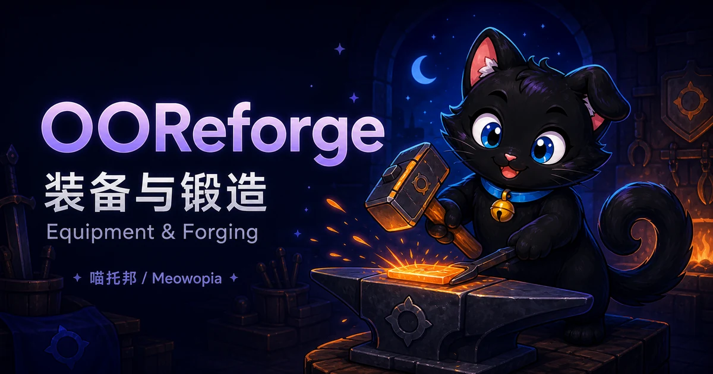

# OOReforge



**分类：独立（Standalone）。项目形态：独立 Paper 插件。状态：尚未正式发布，功能开发暂停。**

OOReforge 是喵托邦 / Meowopia 的装备锻造与重铸插件，面向需要自定义强化、增幅、精炼、材料消耗和打造台的服务器。

!!! warning "当前可用范围"
    截至 2026-09-02，本项目 GitHub 尚无正式 Release。下面介绍的是开发版已有的功能和配置入口，不代表已发布、已完成生产服务器验收或可以直接下载使用。请勿将开发分支版本当成稳定版安装到正式服。

## 功能与使用方式

开发版已包含以下功能入口，正式可用范围以未来发布说明为准：

- **配置打造规则**：定义打造模式、材料、支付要求、成功率、失败处理和装备属性效果。
- **游戏内打造台**：打开指定工作台放入装备，并按配置完成操作；管理员可编辑工作台布局。
- **等级券与异次元属性**：配置可消耗等级券、属性定义和净化或赋予属性的消耗品。
- **状态与运维查询**：查询装备、支付/属性适配状态、交易记录和待处理恢复记录。

分解默认关闭；配置中出现某个第三方插件名，不等于它已完成兼容支持。缺少所选材料、支付或属性支持时，不应继续执行相关打造操作。

## 已实现功能 / Implemented

**暂无正式版；以下仅为 1.3.0 未发布开发工作的实现参考。** 本节核对的是开发源码与配置，不代表已经完成真实服务器使用验收，也不表示已有稳定安装包。

| 开发版已有实现 | 必要条件 | 当前验证范围 |
| --- | --- | --- |
| 配置打造模式、材料、支付要求、成功率、失败处理和属性效果 | 使用有效配置；所选物品、经济与属性适配器实际可用 | 已核对配置及处理代码；第三方组合的实服结算仍需验证 |
| 游戏内打造台、装备预览与确认操作、管理员布局编辑 | 在线玩家、对应权限及已配置工作台 | 已核对入口和界面处理；不宣称玩家完整操作流程已验收 |
| 等级券、异次元属性定义及相关消耗品处理 | 启用对应配置，装备符合条件，必要属性支持可用 | 已核对配置、命令与处理代码；真实物品效果仍需实服验证 |
| 帮助、装备检查、状态和记录查询，以及管理操作 | 对应权限；仅玩家命令不能由控制台执行 | 命令语法与权限已按实际处理逻辑复核；详见本页命令表 |
| 中文/英文消息、配置校验、迁移及重载保护逻辑 | UTF-8 配置；保留版本字段、引用和消息占位符 | 已核对加载与保护实现；历史服务器数据升级仍应先在副本验证 |

## 未实现功能 / Not implemented

- **尚不可用：OOConsole 可视化配置工作区。** 接入准备不等于服主已经可以打开网页编辑锻造配置。
- **尚不可用：OOEngine 客户端窗口。** 不能将现有游戏内工作台当成已完成的客户端窗口接入。
- **部分完成：统一命令与正式前置接入。** 开发版已有 `/oo reforge` 路径，但正式前置要求与最终命令接入尚未完成交付验收。
- **支持有限：第三方适配。** 仅有配置示例或插件名称的条目，不代表已实现；不能把所有列出的经济、物品与属性插件当成兼容清单。
- **未开放：分解流程。** 默认关闭，当前不能作为已交付功能使用。
- **未提供：对外 PAPI 变量。** 本页列出的确认按钮、语言模板与公式变量，仅在各自指定位置生效。
- **尚未完成：正式服务器兼容与发布验收。** 当前没有生产可用或 Paper/Folia 跨版本兼容承诺。

## 未来计划 / Roadmap

以下仅为已有规划，功能开发仍暂停，没有承诺完成日期或发布版本：

1. 完成正式命令与前置接入验证，保持统一 `/oo reforge` 入口，并核实权限、玩家操作与停用清理。
2. 在相应正式接口和运行环境具备条件后，验证可选 OOConsole 配置管理；客户端窗口同样须等待正式窗口能力验收，不另建独立后台。
3. 补齐真实服务器中的打造、消耗、失败处理、恢复及升级回滚验证，确认兼容范围后再准备首个稳定交付。

没有在此承诺新增 PAPI 变量、开放分解或支持全部第三方插件；这些不能由示例配置推导为已批准计划。

## 安装与前置

**目前尚无面向服主的正式安装包。** 以下是未来正式版本的安装准备说明，不是现有生产可用承诺。

1. 准备受该发布版本支持的 Paper 服务端和 Java 环境；当前不宣称 Folia 或任意 Minecraft 版本已经兼容。
2. 按正式产品要求安装 **OOCore（必需前置）**，由它提供统一 `/oo` 命令入口。不要跳过前置检查。
3. 获得正式授权的 OOReforge 主 JAR 后，将 OOCore 与 OOReforge 的插件 JAR 放入服务器 `plugins/` 目录，完整重启服务端。
4. 首次成功启用后，在 `plugins/OOReforge/` 编辑配置，并检查启动日志及 `/oo reforge status`。
5. 按实际打造方案安装需要的经济、物品或属性插件；先在测试服验证完整消耗与结算流程，再开放给玩家。

OOCore 的最低正式验证版本尚未公布；前置必须能提供该 OOReforge 发布版本所需功能，不表示只能安装某个完全相等的版本号。当前开发版仍保留旧兼容启动方式，**正式必需前置要求尚未完成交付验收**，请勿据此省略 OOCore。

OOEngine 与 OOConsole 不是锻造核心功能的必装前置。可选可视化接入仍在开发中，不能因为安装了它们就认为网页编辑或客户端窗口已经可用。

## 命令状态

**以下全部为 1.3.0 未发布开发工作的参考，不是稳定版接口承诺。** 无正式 Release 可用于安装验收；工程中的开发编号不代表已发布版本。

统一命令前缀为 `/oo reforge`，由 OOCore 提供 `/oo`。下表语法与例子均接在该前缀后；例如 `help` 完整输入为 `/oo reforge help`。控制台执行时通常省略开头的斜杠。尖括号必填，方括号可选；Alice 代表在线目标玩家，UUID 须从实际记录复制。所有示例均需相应权限和配置，不要在正式资产上试验管理操作。

| 子命令完整语法 | 默认 / 参数约束 | 用途 | 精确权限 | 执行者 | 最小示例（接前缀） |
| --- | --- | --- | --- | --- | --- |
| `help` | 不输入子命令也显示帮助 | 按权限显示帮助 | `ooreforge.help` | 玩家/控制台 | `help` |
| `open [工作台ID]` | 默认 `reinforcement` | 打开打造台 | `ooreforge.open` | 仅玩家 | `open` |
| `inspect` | 无参数 | 查看主手装备 | `ooreforge.inspect` | 仅玩家 | `inspect` |
| `ticket <等级券ID>` | ID 必填且须已配置 | 打开等级券界面 | `ooreforge.ticket` | 仅玩家 | `ticket reinforcement_12_ticket` |
| `status` | 无参数 | 运行状态 | `ooreforge.admin.status` | 玩家/控制台 | `status` |
| `providers` | 无参数 | 属性支持状态 | `ooreforge.admin.providers` | 玩家/控制台 | `providers` |
| `reload` | 无参数 | 验证并重载配置 | `ooreforge.admin.reload` | 玩家/控制台 | `reload` |
| `editor <工作台ID>` | ID 必填 | 编辑游戏内布局 | `ooreforge.admin.editor` | 仅玩家 | `editor reinforcement` |
| `give-ticket <等级券ID> [数量] [玩家]` | 数量默认 1，范围 1–64；目标默认执行玩家，控制台须填数量与在线玩家 | 发券 | `ooreforge.admin.giveticket` | 玩家/控制台 | `give-ticket reinforcement_12_ticket 1 Alice` |
| `setlevel <玩家> <打造模式ID> <等级> <数量>` | 全部必填；等级非负并通过模式规则；数量至少 1 且不超过目标主手数量 | 设置主手装备等级 | `ooreforge.admin.setlevel` | 玩家/控制台；目标须在线 | `setlevel Alice reinforcement 1 1` |
| `setdimensional <玩家> <属性ID> <数量>` | 全部必填；属性已配置；数量至少 1 且不超过目标主手数量 | 设置主手属性 | `ooreforge.admin.setdimensional` | 玩家/控制台；目标须在线 | `setdimensional Alice strength 1` |
| `audit [recent] [条数]` | 省略动作默认 recent；条数默认 10，1–50；指定条数时需写 recent | 最近记录 | `ooreforge.admin.audit` | 玩家/控制台 | `audit` |
| `audit show <事务UUID>` | UUID 必填 | 事务历史 | `ooreforge.admin.audit` | 玩家/控制台 | `audit show <事务UUID>` |
| `audit search <关键词> [条数]` | 单个关键词；条数默认 10，1–50 | 搜索记录 | `ooreforge.admin.audit` | 玩家/控制台 | `audit search reinforcement` |
| `recovery [list]` | 默认 list；最多显示 10 条 | 待恢复记录 | `ooreforge.admin.recovery` | 玩家/控制台 | `recovery` |
| `recovery show <事务UUID>` | UUID 必填 | 查看恢复详情 | `ooreforge.admin.recovery` | 玩家/控制台 | `recovery show <事务UUID>` |
| `recovery mark <事务UUID> <committed或rolled_back> [备注]` | 备注可含空格；省略时记录执行者 | 人工标记已核实的处理结果，不是自动退款命令 | `ooreforge.admin.recovery` | 玩家/控制台 | `recovery mark <事务UUID> rolled_back 已核对` |
| `recovery close-empty-ready confirm` | confirm 必填 | 关闭未扣款的 READY 恢复记录 | `ooreforge.admin.recovery` | 玩家/控制台 | `recovery close-empty-ready confirm` |
| `payment-test <支付源> <资产> <数量> confirm` | 正整数数量；支付源和资产须匹配实际配置；无默认 | 对执行玩家真实扣款再退款 | `ooreforge.admin.paymenttest` | **仅玩家** | `payment-test <支付源> <资产> 1 confirm` |

支付测试退款失败时可能留下实际损失；恢复命令可能改变记录状态，必须先备份并核实。开发版保留 `/ooreforge`、`/ooref`、`/oor`、`/mythicreforge`、`/mreforge`、`/mr` 兼容入口，新配置统一使用 `/oo reforge`。

### 权限与继承

以下为 descriptor 默认值与实际命令处理检查的对应关系。权限管理插件的显式配置可改变最终授权；没有定义 `ooreforge.*` 通配符。

| 精确权限 | 功能 / 实际继承 | 声明默认 |
| --- | --- | --- |
| `ooreforge.player` | 授予 help、open、inspect、ticket 四个完整节点 | 普通玩家与 OP |
| `ooreforge.use` | 旧普通权限组，同样授予上述四项 | 普通玩家与 OP |
| `ooreforge.help` | 帮助 | 普通玩家与 OP |
| `ooreforge.open` | 打开工作台 | 默认无直接授权，由普通权限组继承 |
| `ooreforge.inspect` | 查看主手装备 | 默认无直接授权，由普通权限组继承 |
| `ooreforge.ticket` | 等级券界面 | 默认无直接授权，由普通权限组继承 |
| `ooreforge.admin` | 授予下面全部十个 admin 子节点 | OP |
| `ooreforge.admin.status` | 状态 | 默认无直接授权；由 admin 继承 |
| `ooreforge.admin.reload` | 重载 | 默认无直接授权；由 admin 继承 |
| `ooreforge.admin.providers` | 属性适配查询 | 默认无直接授权；由 admin 继承 |
| `ooreforge.admin.editor` | 游戏内布局编辑 | 默认无直接授权；由 admin 继承 |
| `ooreforge.admin.giveticket` | 发券 | 默认无直接授权；由 admin 继承 |
| `ooreforge.admin.setlevel` | 管理员改等级 | 默认无直接授权；由 admin 继承 |
| `ooreforge.admin.setdimensional` | 管理员改属性 | 默认无直接授权；由 admin 继承 |
| `ooreforge.admin.audit` | 审计查询 | 默认无直接授权；由 admin 继承 |
| `ooreforge.admin.recovery` | 恢复管理 | 默认无直接授权；由 admin 继承 |
| `ooreforge.admin.paymenttest` | 真实支付测试 | 默认无直接授权；由 admin 继承 |

兼容权限均默认不授予；每个节点仅把对应的新节点设为 true，不是通配符：

| 旧节点 | 授予的新节点 |
| --- | --- |
| `mythicreforge.player` | `ooreforge.player` |
| `mythicreforge.use` | `ooreforge.use` |
| `mythicreforge.help` | `ooreforge.help` |
| `mythicreforge.open` | `ooreforge.open` |
| `mythicreforge.inspect` | `ooreforge.inspect` |
| `mythicreforge.ticket` | `ooreforge.ticket` |
| `mythicreforge.admin` | `ooreforge.admin` |
| `mythicreforge.admin.status` | `ooreforge.admin.status` |
| `mythicreforge.admin.reload` | `ooreforge.admin.reload` |
| `mythicreforge.admin.providers` | `ooreforge.admin.providers` |
| `mythicreforge.admin.editor` | `ooreforge.admin.editor` |
| `mythicreforge.admin.giveticket` | `ooreforge.admin.giveticket` |
| `mythicreforge.admin.setlevel` | `ooreforge.admin.setlevel` |
| `mythicreforge.admin.setdimensional` | `ooreforge.admin.setdimensional` |
| `mythicreforge.admin.audit` | `ooreforge.admin.audit` |
| `mythicreforge.admin.recovery` | `ooreforge.admin.recovery` |
| `mythicreforge.admin.paymenttest` | `ooreforge.admin.paymenttest` |

## 变量与占位符（开发版参考）

**当前暂无对外 PlaceholderAPI（PAPI）变量/占位符。** 没有供聊天插件、计分板或其他插件调用的 `%ooreforge_…%` 扩展；安装 PAPI 不会自动提供它。下面是本插件自己的模板和公式，不是 PAPI，也不是 OOConsole 或客户端 UI 绑定。

### 工作台确认按钮

仅作用于 `config.yml` 的 `stations.<工作台ID>.icons.confirm` 中 display-name 和 lore，在有效装备预览生成时替换。不能套用到界面标题、任意物品或其他插件。示例仅表示显示格式，实际由装备和配置决定；无需 PAPI。

| 精确写法 | 含义 | 替换示例 |
| --- | --- | --- |
| `{success_rate}` | 当前预览成功率，不自带百分号 | `50`，模板可写 `{success_rate}%` |
| `{cost}` | 支付展示金额 | `100` |
| `{currency}` | 支付展示货币标识 | 按所选支付方案显示 |
| `{materials}` | 材料需求摘要 | 按所选支付方案显示 |
| `{payments}` | 完整支付需求摘要 | 按所选支付方案显示 |
| `{current_level}` | 当前打造等级 | `1` |
| `{next_level}` | 预览目标等级 | `2` |
| `{minimum_level}` | 模式要求最低玩家等级 | `0` |
| `{craft}` | 模式显示名称，不是 ID | `强化` |

例如确认按钮 lore 可写 `成功率：{success_rate}%` 和 `支付：{payments}`。显示模板不能改变真实支付结果。

### 配置表达式

`level`（无花括号）是等级表达式变量，例如异次元属性 `value: "level * 3"` 传入增幅等级 2 时得到 6。只在接受等级公式的字段中使用，不是全局文本替换，不支持脚本。支持整数、括号和加减乘除；整数除法截断，非法或超范围结果拒绝。不同字段传入等级的语义不同，不要将它当成通用玩家等级。

### 语言消息模板

仅作用于 `lang/zh_CN.yml` 与 `lang/en_US.yml` 对应消息键。只有触发该消息的操作提供的变量会替换；同名变量在不同消息中可有不同含义，不能跨消息复制后就认定可用。无需 PAPI。

下表按随包中文模板列出精确写法和上下文；模板原文说明变量含义。例如 `common.no_permission` 的 `{permission}` 可显示 `ooreforge.admin.reload`，`status.recovery` 的 `{count}` 可显示 `0`。表内花括号表示模板，不是已执行输出。

| 消息键 / 作用域 | 精确占位符 | 随包显示模板（含义参考） |
| --- | --- | --- |
| `common.no_permission` | {permission} | 你没有权限：{permission} |
| `help.header` | {version} | &dOOReforge {version} &7- 可用命令 |
| `status.header` | {version}、{configured}、{effective} | OOReforge {version} \| 配置安全模式={configured} \| 实际安全模式={effective} |
| `status.recovery` | {count} | 未完成恢复记录={count} |
| `status.audit` | {count} | 未完成审计事务={count} |
| `status.sources` | {sources} | 支付源={sources} |
| `status.refund_safety` | {capabilities} | 自动退款安全能力={capabilities} |
| `status.vault` | {economy} | Vault 经济后端={economy} |
| `reload.rejected` | {error} | OOReforge 重载被拒绝，旧运行配置继续生效：{error} |
| `setlevel.target_online` | {player} | 目标玩家不在线：{player} |
| `setlevel.quantity` | {requested}、{available} | 主手物品数量不足：需要 {requested}，当前 {available}。 |
| `setlevel.rejected` | {error} | 无法设置打造等级：{error} |
| `setlevel.success` | {player}、{amount}、{craft}、{level} | 已将 {player} 主手装备中的 {amount} 件物品设置为 {craft} +{level}。未消耗金币或材料。 |
| `setlevel.received` | {amount}、{craft}、{level} | 管理员已将你主手装备中的 {amount} 件物品设置为 {craft} +{level}。 |
| `setdimensional.target_online` | {player} | 目标玩家不在线：{player} |
| `setdimensional.quantity` | {requested}、{available} | 主手物品数量不足：需要 {requested}，当前 {available}。 |
| `setdimensional.rejected` | {error} | 无法设置异次元属性：{error} |
| `setdimensional.success` | {player}、{amount}、{attribute} | 已将 {player} 主手装备中的 {amount} 件物品设置为异次元属性 {attribute}。未消耗金币或材料。 |
| `setdimensional.received` | {amount}、{attribute} | 管理员已将你主手装备中的 {amount} 件物品设置为异次元属性 {attribute}。 |
| `editor.usage` | {stations} | 用法：/oo reforge editor &lt;工作台ID&gt; \| 可用={stations} |
| `editor.unknown` | {station}、{stations} | 未知工作台：{station} \| 可用={stations} |
| `editor.opened` | {station} | 已打开 {station} 可视化布局编辑器。点击一个功能标记，再点击目标槽位；关闭界面后选择保存或放弃。 |
| `payment_test.insufficient` | {source}、{asset} | 支付测试被拒绝：{source}:{asset} 余额不足。 |
| `payment_test.refund_failed` | {amount}、{source}、{asset} | 严重错误：扣款成功但退款失败，请检查控制台并手工返还 {amount} {source}:{asset}。 |
| `payment_test.passed` | {source}、{asset}、{amount} | 支付测试净零通过：{source}:{asset}，数量={amount} |
| `payment_test.failed` | {error} | 支付测试在完成扣款/退款前失败：{error} |
| `station.delegated` | {provider} | 分解功能已交由 {provider} 处理。 |
| `station.unknown` | {station}、{available} | 未知工作台：{station} \| 可用={available} |
| `station.preview_failed` | {error} | 无法预览打造：{error} |
| `station.transaction` | {id}、{status}、{message} | 事务 {id} \| {status} \| {message} |
| `station.rejected` | {error} | 打造被拒绝：{error} |
| `ticket.available` | {tickets} | 可用等级券：{tickets} |
| `ticket.unknown` | {ticket}、{available} | 未知等级券：{ticket} \| 可用={available} |
| `ticket.given` | {player}、{amount}、{ticket} | 已向 {player} 发放 {amount} 个 {ticket}。 |
| `ticket.title` | {level} | +{level} 强化券 |
| `ticket.preview_name` | {level}、{craft} | +{level} {craft} |
| `ticket.cannot_apply` | {error} | 等级券无法使用：{error} |
| `ticket.applied` | {level}、{craft} | 已100%成功应用 +{level} {craft}。 |
| `ticket.rolled_back` | {error} | 等级券事务已回滚：{error} |
| `inspect.schema` | {schema}、{upgrades} | 数据版本={schema} 打造等级={upgrades} |
| `inspect.invalid` | {errors} | 状态=无效 {errors} |
| `inspect.corrupt` | {error} | OOReforge 数据无效：{error} |
| `dimensional.selected` | {attribute} | 已选择：{attribute} |
| `dimensional.applied` | {attribute} | 已应用异次元属性：{attribute} |
| `dimensional.rejected` | {error} | 操作被拒绝：{error} |
| `recovery.list_header` | {count} | 未完成恢复记录：{count} |
| `recovery.list_entry` | {id}、{status}、{player}、{station}、{craft}、{debits} | {id} 状态={status} 玩家={player} 工作台={station} 打造={craft} 扣款项={debits} |
| `recovery.unknown` | {id} | 未知恢复事务：{id} |
| `recovery.detail_header` | {id}、{status} | 恢复事务 {id} 状态={status} |
| `recovery.detail_context` | {player}、{station}、{craft}、{slot} | 玩家={player} 工作台={station} 打造={craft} 槽位={slot} |
| `recovery.detail_snapshot` | {fingerprint}、{bytes} | 指纹={fingerprint} 快照字节数={bytes} |
| `recovery.debit` | {source}、{asset}、{amount}、{account} | 扣款 {source}:{asset} x{amount} 账户={account} |
| `recovery.detail_message` | {message} | 消息={message} |
| `recovery.invalid_uuid` | {value} | 无效UUID：{value} |
| `recovery.marked` | {id}、{status} | 恢复与审计事务 {id} 已标记为 {status}，未修改任何资产。 |
| `recovery.closed` | {closed}、{skipped} | 已关闭无扣款READY事务：{closed}，跳过：{skipped} |
| `audit.list_header` | {count} | 最近审计事务：{count} |
| `audit.history_header` | {id}、{count} | 事务 {id} 的完整状态历史：{count} 条 |
| `audit.search_header` | {query}、{count} | 审计搜索“{query}”：{count} 条 |
| `audit.entry` | {time}、{id}、{status}、{craft}、{from}、{to}、{cost}、{materials}、{message} | {time} \| {id} \| {status} \| {craft} {from}→{to} \| 费用={cost} 材料={materials} \| {message} |
| `audit.unknown` | {id} | 未知审计事务：{id} |
| `providers.header` | {count} | 属性 Provider：{count} |
| `providers.entry` | {id}、{type}、{available} | {id} \| 类型={type} \| 可用={available} |
| `providers.dimensional_header` | {count} | 异次元属性映射：{count} |
| `providers.dimensional_entry` | {id}、{provider}、{attribute}、{supported} | {id} → {provider}:{attribute} \| 支持={supported} |
| `integrations.header` | {author} | &d[OOReforge] &f可选插件自动识别 \| 作者：&b{author} |
| `integrations.enabled` | {plugin} | &7- &f{plugin} &a[已启用] |
| `integrations.disabled` | {plugin} | &7- &f{plugin} &e[未启用] |

## OOConsole（planned / blocked）

**可视化管理尚不可用。** 当前没有可供服主依照本页启用的 OOConsole 锻造工作区或 OOEngine 客户端窗口；请使用未来正式版本说明，不要寻找另一个独立 Web 后台。游戏内工作台布局编辑与网页配置管理是不同功能。

## 配置 / Configuration

用户配置位于插件自己的 `plugins/OOReforge/` 目录：

| 文件 | 内容 | 生效方式 |
| --- | --- | --- |
| `config.yml` | 打造模式、材料、支付组合、属性效果、工作台布局、等级券、安全和审计设置 | 受支持字段使用 `/oo reforge reload`；审计文件位置变更需完整重启 |
| `lang/zh_CN.yml` | 简体中文消息 | 修改后重载并检查消息 |
| `lang/en_US.yml` | 英文消息 | 修改后重载并检查消息 |

这些是开发版随包模板；尚无正式发布包提供下载。文件使用 UTF-8 和 YAML 格式，缩进使用空格。保留消息占位符，勿在配置中填写密码、令牌或任意脚本。`plugin.yml` 是插件描述文件，不是服主配置文件。

下面只演示主配置中的四个现有字段，**应合并到完整配置中，不能用这四行覆盖整个文件**：

```yaml
# 配置格式版本，请勿自行提高 / Schema version; do not increase manually.
schema-version: 2
# 消息语言 / Message locale: zh_CN or en_US.
language: zh_CN
# 保持安全模式 / Keep safety mode enabled.
safe-mode: true
# 默认不允许永久损毁 / Permanent destruction is disabled by default.
allow-destruction: false
```

详细规则集中在 `crafts`（打造模式）、`materials`（材料）、`payment-profiles`（支付组合）、`failure-policies`（失败规则）、`attribute-profiles`（属性效果）和 `stations`（工作台）等节点。修改 ID 时应同时检查所有引用，不要随意更改已有装备使用的稳定属性 ID。

切换 `language` 不会自动翻译服主自己填写的物品名、描述或工作台文本。语言文件与主配置都包含注释；重载报错时先修复错误，不要反复重启或删除原文件尝试“重置”。

## 升级与回滚

- 目前没有正式升级包，不能承诺任意历史版本可直接升级。
- 升级前停服并备份插件 JAR、完整数据目录及相关玩家物品、经济数据；配置备份不能替代资产备份。
- 开发版具有旧配置迁移与默认值合并逻辑，但这不是生产迁移验收结论；先在副本上检查自定义文本、规则、语言和工作台。
- 不手动提高 `schema-version`，也不把新配置直接交给旧插件。回滚时恢复同一备份点的插件与数据，避免重复扣款、退款或发放装备。
- 损坏配置的重载应保留上一次有效配置；首次启动无法安全加载时可能停用插件。发现异常先留存原文件和错误信息。

## 验证状态

当前为未发布开发版，尚无正式稳定版或完整生产兼容承诺。未完成的可视化接入、正式前置验收以及 Paper/Folia 实际使用验证，不能用编译成功或自动化测试代替。

## 已知问题与限制

- 功能开发暂停；本页更新不意味着恢复开发或公布发布日期。
- 支付、材料与属性插件的兼容性取决于实际适配器和版本；配置里的示例开关不是兼容保证。
- 默认不开放分解；OOConsole 工作区与 OOEngine 窗口尚不可用。
- 开启损毁、调整失败规则、执行支付测试或人工恢复前，务必在隔离测试服验证并保留备份。
- 未来正式版本采用专有许可；历史已经授予的许可不被追溯撤回，第三方内容仍按其原许可处理。

## 联系 / Contact

反馈时请提供插件版本、服务端类型、重现步骤和经过脱敏的错误信息。不要公开凭据、完整玩家数据或私人配置。

- 作者 / Author: zkonikishi
- QQ: 276098266
- Discord: <https://discord.gg/KPq2fZHFK>
- [ifdian](https://ifdian.net/a/zkonikishi)
- QQ群 / QQ Group: 1063369777
