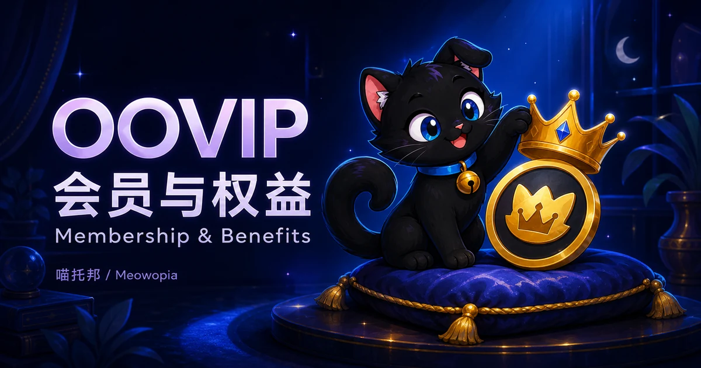

# OOVIP



**分类：独立（Standalone）。状态：开发中，尚未发布正式版本。**

OOVIP 是喵托邦 / Meowopia 的会员生命周期与权益编排插件，管理会员有效期、续费、升档与权益到期处理。它不替代权限、支付、时装或菜单插件，而是组合这些能力。产品目标是可自定义会员体系；VIP、SVIP、MVP 是官方参考方案，不是要求所有服务器采用的玩法。

## 功能与可用状态

当前没有面向生产服务器的正式稳定版。开发版已有会员开通、续费、升档、移除、SQLite 持久保存、重复请求保护、到期权益处理，以及 LuckPerms 和 PlaceholderAPI 接入代码。这不等于已完成真实服务器联动验收，请勿直接用于付费运营。

通用档位和成长配置、完整多产品会员隔离、成长触发 VID、会员中心界面仍在开发中。自动购买、充值订单和退款尚不可用；不能靠开启配置开关启用支付。会员不会因此获得管理员权限。

## 已实现功能 / Implemented

**暂无正式版；以下仅为 `1.0.0-SNAPSHOT` 开发版实现，不代表生产服务器可用。**

| 能力 | 适用条件与验证范围 |
| --- | --- |
| 开通、续费、升档、移除及授权赠送开通 | 开发版已有业务处理与命令接线，使用 SQLite 和兼容 OOCore；已有自动化验证，真实玩家/控制台联动仍待验收。赠送不包含扣款。 |
| 会员保存、重复操作保护和到期权益处理 | 开发版已有持久保存与恢复处理代码及自动化验证；跨重启、离线到期的实际服务器表现仍待验收。 |
| LuckPerms 会员组权益发放与撤销 | 开发版已有适配代码；需要可用 LuckPerms。实际插件组合及缺失/停用场景尚未完成实机认证。 |
| PlaceholderAPI 会员状态展示 | 开发版已有注册与解析，需启用 PlaceholderAPI 和对应开关；只读取玩家快照，变量与限制见本页占位符表，不能保证实时性或重启后立即有值。 |
| VID 唯一分配基础 | 开发版已有分配及重复分配保护的自动化验证；尚未接通玩家成长触发，不能据此宣称玩家已可领取 VID。 |

## 未实现功能 / Not implemented

- **部分实现：自由会员配置。** 当前仍有固定档位与期限限制；不能仅修改配置列表就添加任意档位、成长曲线或等级上限。
- **部分实现：会员成长、VID 与产品隔离。** 尚不能完成成长达标自动获得 VID 的用户流程，也不能完整管理跨产品独立会员合约。
- **尚不可用：自动购买、充值订单及退款。** 支付入口明确禁用；配置开关不是交易实现。
- **尚不可用：会员中心 GUI、礼包领取与临时时装完整联动。** 不应把相关 Provider 名称或计划中的命令当成现成功能。
- **待完善：中文交互与配置生效一致性。** 命令仍有英文/状态码，部分适配器开关未形成可靠控制；具体限制见配置和命令章节。
- **待验收：稳定服务器兼容与升级恢复。** 尚无正式发布支持矩阵，不能保证直接从历史插件原地升级。

## 未来计划 / Roadmap

- 优先完善可配置会员核心，使官方档位、成长规则和权益包成为可替换模板，同时保留权限校验、重复请求保护与数据一致性约束。
- 接通会员成长与全局 VID 流程，完善共享及隔离会员模式；通过正式接口供其他产品读取，不复制会员数据库。
- 在正式经济服务可用并通过交易验证后完善购买与订单恢复；展示和时装联动同样以正式可选接口为前提。
- 完善安装、迁移、回滚和 Paper/Folia 实际运行验证，再确定稳定版交付范围。以上是规划方向，不承诺日期或版本。

## 安装前置与安装

- 必须安装兼容的 OOCore，由它提供 `/oo` 命令入口、可信操作身份和插件生命周期服务。
- 目前没有可推荐的最低实机验证版本组合。开发接入使用过 OOCore 1.6.1 API，但这不是生产兼容认证，也不是要求永远使用该版本。正式版本发布后，以其兼容说明为准。
- OOEngine、OOConsole、LuckPerms、PlaceholderAPI 等不是 OOVIP 的硬前置。只有使用相应集成时才需要它们；配置中出现的 Provider 不代表该功能已经完成。
- 仅获准测试时，将插件 JAR 放入测试服务器的 `plugins/`，安装兼容 OOCore 后完整启动。首次启动生成 `plugins/OOVIP/config.yml`；默认数据库位于 `plugins/OOVIP/data/oovip.db`。

不要将开发版安装到正在收款的生产服务器。Paper/Folia 的实际支持范围仍待正式验收，描述文件声明不等于运行认证。

## 命令

以下是当前开发版已接线的入口，正式使用仍待发布。OOVIP 不另外注册 `/vip` 根命令。

| 命令 | 用途 |
| --- | --- |
| `/oo vip` 或 `/oo vip status` | 玩家查询自己的会员状态 |
| `/oo vip add <UUID> <tier> <term> <requestId>` | 管理员开通会员 |
| `/oo vip renew <UUID> <tier> <term> <requestId>` | 管理员续费；当前参数格式保留 tier，但续费不改变档位 |
| `/oo vip upgrade <UUID> <tier> <term> <requestId>` | 管理员升档 |
| `/oo vip remove <UUID> <requestId>` | 管理员移除会员 |
| `/oo vip gift <UUID> <tier> <term> <requestId>` | 有授权的玩家赠送开通；不是付费购买入口 |
| `/oo vip buy` | 当前明确返回支付服务不可用 |

`UUID` 必须是玩家 UUID，不是昵称。当前付费 tier 为 `VIP`、`SVIP`、`MVP`；term 为 `MONTH`、`QUARTER`、`YEAR`、`PERMANENT`。这些仍是开发版限制，不能通过随意编辑列表增加新档位。每次新操作使用新的 requestId；重试同一操作保持原值。

根权限为 `oovip.command.vip`；状态查询另需 `.status`，管理操作另需 `.admin.add`、`.admin.renew`、`.admin.upgrade` 或 `.admin.remove`，赠送另需 `.gift`（均接在根权限后）。不要仅凭旧的 `oovip.admin` 节点推断授权。状态查询及赠送要求真实玩家身份，控制台可执行管理员操作。`claim`、`set`、`reload` 尚无对应处理，不应当作可用命令。

## 配置 / Configuration

当前用户主配置只有 `config.yml`。旧版的 `config_lp.yml`、`config_pex.yml`、`messages` 语言模板、`custom.yml` 和 `script.js` 不属于当前 OOVIP 配置体系。

以下片段用于说明现有字段，应合并到生成的默认文件，而不是删除其他配置：

```yaml
locale: zh_CN
timezone: Asia/Shanghai
storage:
  type: sqlite
  sqlite:
    file: data/oovip.db
membership:
  reconciliation-seconds: 60
```

- `timezone` 是有效 IANA 时区，用于时间展示。
- 数据库路径必须留在 OOVIP 数据目录内；不要通过路径跳转访问外部文件。
- 到期检查间隔单位为秒，范围 30–3600；间隔越短，检查越频繁。
- 当前必须使用 SQLite。虽然模板包含 MySQL 字段，选择 MySQL 会被拒绝。
- `membership.tiers` 尚未成为通用档位配置入口；等级上限、成长曲线和 VID 规则的自由配置仍在开发中。
- PlaceholderAPI 开关已有读取；OOConsole 默认关闭。其他 adapter 开关不应被视为完整有效的功能开关，尤其当前 LuckPerms 接线不能仅凭其开关判断停用。
- 修改配置后完整停服再启动；不要使用热加载工具。数据库密码和支付密钥不要写进配置、公开日志或截图。

## 中文本地化

配置含中英说明，保留 `locale` 字段，但当前命令输出仍有英文和状态码。旧版中文消息模板的完成状态不适用于本版；完整中文交互尚待完善。

## 升级与已知问题

- 本版未提供从历史 VipSystem 配置和数据库直接升级的保证；不要直接覆盖旧插件目录或复用旧数据库。
- 测试升级前完整停服，备份插件 JAR、配置和数据库目录。回滚时同时恢复对应版本的配置与数据库副本，不要让旧版读取迁移后的数据库。
- 支付、礼包、GUI、通用自定义档位和完整成长/VID 联动尚不可用。
- 服务端重启恢复、可选插件缺失及运行时兼容仍需完整验收；Placeholder 显示也不应作为发放权益的权威依据。
- 暂无正式下载版本。源码为闭源资料，仅授权维护者可访问；请通过下列渠道获取用户支持。

## Java 兼容目标

OOVIP 新增 Java 21 兼容目标，优先验证 Paper 1.20.5、1.20.6 及 1.21–1.21.11 的不同 API 阶段；更早的 1.20.x 后续单独评估。**这不是已支持版本清单：目前尚无上述平台的 OOVIP 正式兼容验收。**

现有 Java 25 / Minecraft 26.x 方向保留；26.x 服务器不能改用 Java 21 运行。兼容工作须先满足 OOCore 等正式依赖的要求，再验证安装、命令、权限、变量和数据恢复。Folia 单独验收，不因 Paper 兼容而自动支持，也不新增 Spigot 承诺。当前仍无正式发布版。

MC/Paper/Folia 跨版本识别和适配统一由 OOCore 提供，OOVIP 不维护独立的游戏版本兼容层。OOVIP 仍须保证自身与必要依赖能够在 Java 21 加载，并通过 OOCore 正式接口验证会员业务。升级 OOCore 不能替代插件自身的字节码适配，也不代表任何未来版本都无需调整。

## 联系 / Contact

- 作者 / Author: zkonikishi
- QQ: 276098266
- Discord: <https://discord.gg/KPq2fZHFK>
- [ifdian](https://ifdian.net/a/zkonikishi)
- QQ群 / QQ Group: 1063369777

## 命令参数与最小示例（开发版参考）

以下全部要求根权限 `oovip.command.vip`，并叠加表中精确权限。没有参数时默认 `status`；所有修改操作的 UUID、tier、term、requestId 均无默认值（remove 不接收 tier/term）。示例 UUID 仅为格式示例，执行时须换成实际目标；requestId 重试不变、新操作必须换新值。

| 完整语法 | 额外权限 | 执行身份 | 最小示例 |
| --- | --- | --- | --- |
| `/oo vip [status]` | `oovip.command.vip.status` | 玩家本人，不支持控制台查询 | `/oo vip status` |
| `/oo vip add <UUID> <tier> <term> <requestId>` | `oovip.command.vip.admin.add` | 授权玩家或控制台 | `/oo vip add 123e4567-e89b-12d3-a456-426614174000 VIP MONTH grant-001` |
| `/oo vip renew <UUID> <tier> <term> <requestId>` | `oovip.command.vip.admin.renew` | 授权玩家或控制台 | `/oo vip renew 123e4567-e89b-12d3-a456-426614174000 VIP MONTH renew-001` |
| `/oo vip upgrade <UUID> <tier> <term> <requestId>` | `oovip.command.vip.admin.upgrade` | 授权玩家或控制台 | `/oo vip upgrade 123e4567-e89b-12d3-a456-426614174000 SVIP MONTH upgrade-001` |
| `/oo vip remove <UUID> <requestId>` | `oovip.command.vip.admin.remove` | 授权玩家或控制台 | `/oo vip remove 123e4567-e89b-12d3-a456-426614174000 remove-001` |
| `/oo vip gift <UUID> <tier> <term> <requestId>` | `oovip.command.vip.gift` | 仅授权玩家 | `/oo vip gift 123e4567-e89b-12d3-a456-426614174000 VIP MONTH gift-001` |
| `/oo vip buy` | 无额外检查，仅根权限 | 玩家或控制台；始终返回不可用 | `/oo vip buy` |

renew 当前保留 tier 参数但不使用它修改档位。gift 是受控开通操作，不会自动扣款或从赠送者转移会员；不要授予普通玩家该权限作为商城替代。buy 返回 `OOVIP_PAYMENT_PROVIDER_UNAVAILABLE`，没有成功购买路径。

## 权限（开发版参考）

| 精确节点 | 对应功能 | 默认与继承 |
| --- | --- | --- |
| `oovip.use` | 描述文件声明的旧访问节点；当前命令不检查此节点 | 默认所有玩家；未声明 children |
| `oovip.admin` | 描述文件声明的旧管理节点；不等同于下列管理权限 | 默认 OP；未声明 children |
| `oovip.command.vip` | `/oo vip` 注册入口检查 | 未由 OOVIP 声明默认值或继承 |
| `oovip.command.vip.status` | 查询本人状态 | 未由 OOVIP 声明默认值或继承 |
| `oovip.command.vip.admin.add` | 开通 | 未由 OOVIP 声明默认值或继承 |
| `oovip.command.vip.admin.renew` | 续费 | 未由 OOVIP 声明默认值或继承 |
| `oovip.command.vip.admin.upgrade` | 升档 | 未由 OOVIP 声明默认值或继承 |
| `oovip.command.vip.admin.remove` | 移除 | 未由 OOVIP 声明默认值或继承 |
| `oovip.command.vip.gift` | 玩家赠送开通 | 未由 OOVIP 声明默认值或继承 |

未声明不等于强制拒绝所有人：实际结果由 OOCore 授权服务和服务器权限配置决定，目前不能承诺 OP/普通玩家的最终默认结果。应显式配置所需节点并在测试服核验。OOVIP 没有定义 `oovip.*` 或 `oovip.command.vip.admin.*` 的通配符继承；不能把名称前缀当作父子授权。

## 变量 / 占位符（开发版参考）

当前有以下 **PlaceholderAPI** 扩展接口，尚非正式发布保证。需要 PlaceholderAPI 已启用、`adapters.placeholderapi: true`，且 OOVIP 成功注册。使用位置必须支持 PAPI 并提供玩家上下文，例如明确支持 PAPI 的其他插件文本；不是任意配置都会自动替换。

| 精确写法 | 含义 | 有快照时的显示示例 |
| --- | --- | --- |
| `%oovip_tier%` | 当前快照会员档位 ID | `vip` |
| `%oovip_tier_name%` | 档位显示名；当前接线仍返回 ID | `vip`，不是保证显示“OO会员” |
| `%oovip_expire_time%` | 配置时区的到期时间；永久为固定文本 | `2026-10-01 12:00:00 Asia/Shanghai` 或 `permanent` |
| `%oovip_remaining_days%` | 快照时剩余天数，按秒向上取整；永久为 0 | `30` 或 `0`；0 不能单独判断到期 |
| `%oovip_is_active%` | 快照捕获时是否有效 | `true`；当前失效会移除快照，通常为空而非 false |
| `%oovip_continuous_days%` | 快照时连续开通的完整天数 | `12` |
| `%oovip_points%` | 会员积分快照；当前接线固定传入 0 | `0`，不代表积分系统已经可用 |

作用域是所查询玩家 UUID 的内存快照。没有快照时，以上已识别变量返回空字符串；没有玩家上下文或未知变量返回未解析结果，由使用方决定显示方式。快照不是按每次查询读取数据库或重新计时，重启后也没有保证立即恢复所有玩家快照；不要据此扣款、授权或判断实时到期。

当前没有已支持的 OOVIP 消息模板变量、UI 绑定变量或任意配置替换语法。VID、realm、成长等内部字段不能当作已有 PAPI 变量使用。
